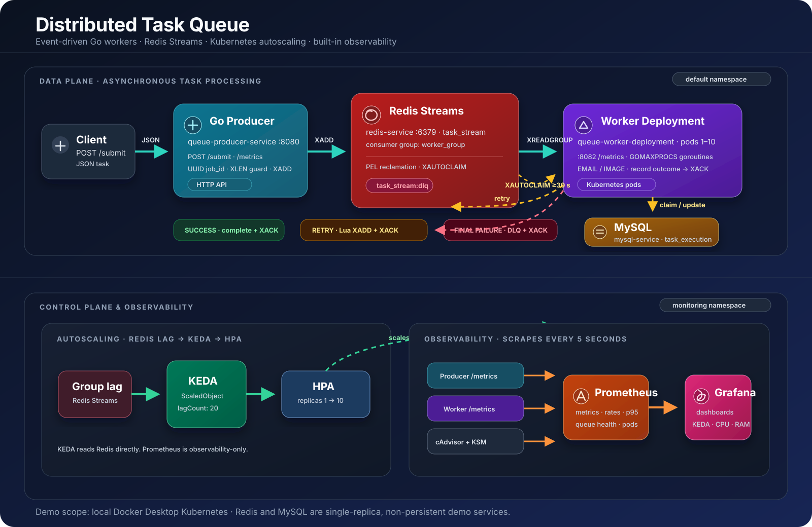
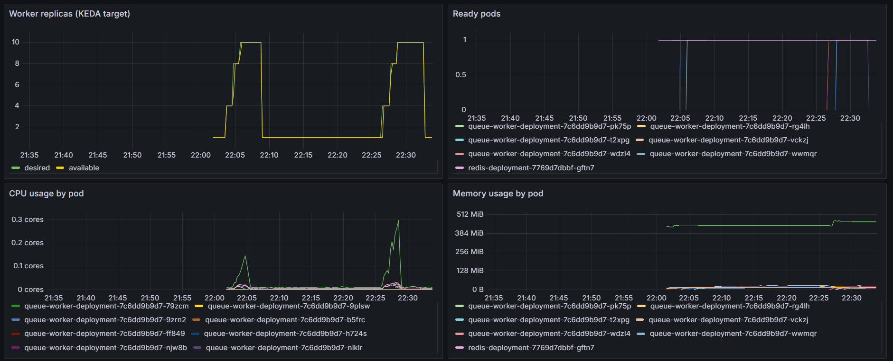
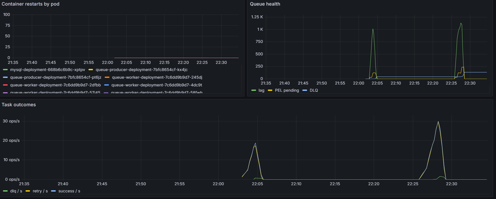

# Distributed Task Queue

A CV-focused learning project that demonstrates asynchronous task processing with Go, Redis Streams, MySQL-backed duplicate suppression, Prometheus/Grafana, and Kubernetes manifests.

> Scope: this is a local observability and Kubernetes learning demo, not a hardened production queue. The README intentionally documents the behavior that exists today, including its limitations.

## What it demonstrates

- a Go producer API that accepts a JSON task and appends it to a Redis Stream
- Redis Streams consumer groups with concurrent Go worker goroutines
- MySQL-backed task-execution records used for best-effort duplicate suppression
- immediate retry, a Redis Streams dead-letter queue (DLQ), and pending-entry reclamation
- Prometheus metrics and provisioned Grafana dashboards for local Docker Compose and Kubernetes
- Kubernetes manifests for the producer, worker, Redis, MySQL, and monitoring
- a KEDA Redis Streams `ScaledObject` configured for consumer-group lag and functionally live-tested on Docker Desktop Kubernetes

## Architecture



*Solid teal arrows show task delivery, dashed amber arrows show retry/recovery, dashed green arrows show KEDA/HPA control flow, and orange arrows show the metrics path. The source SVG is editable at [docs/images/architecture.svg](docs/images/architecture.svg).*

### Task processing flow

The producer only checks that the body is JSON; it does not enforce an application schema or persist metadata itself. The demo handlers registered by the worker are `EMAIL` and `IMAGE`, so submit a string `type` with one of those values.

MySQL is used by workers, not by the producer. It creates a `task_execution` table and records `processing` or `completed` status keyed by `job_id`.

### Retry and recovery semantics

- A failed task is immediately re-added to `task_stream` by a Lua script while the old pending entry is acknowledged. There is no delayed or exponential task backoff.
- `maxRetries` is currently `3`, but the `<=` condition in the implementation produces four requeues (`retry_count` 1 through 4); the next failed execution goes to `task_stream:dlq`.
- Every worker polls the Pending Entries List (PEL) every five seconds and uses `XAUTOCLAIM` for entries idle for at least 30 seconds.
- This is a best-effort, at-least-once recovery pattern. It is not an exactly-once guarantee: a stale MySQL `processing` record has no lease/recovery path, and shutdown acknowledgements can fail and be reclaimed later.
- The repository has a DLQ stream, but no replay API or replay service. Inspect and replay DLQ messages manually.

### Graceful shutdown behavior

The worker listens for `SIGINT` and `SIGTERM` through `signal.NotifyContext`. On cancellation, the dispatcher stops accepting new Redis messages, the PEL reclaimer and queue-health poller stop, the dispatcher closes the in-memory task channel, and `pool.Run` waits for worker goroutines that were already given a task before the process exits.

This is only a best-effort drain, not a durable "finish, record completion, then ACK" protocol. The current `EMAIL` and `IMAGE` demo handlers do not stop their simulated sleep when the context is cancelled. More importantly, the same cancelled context is passed to `MarkCompleted`, retry/release, and Redis `XACK`; their failures are not fully handled. A task can therefore finish its handler during shutdown yet remain in the PEL, then be reclaimed after 30 seconds. Do not treat the `Shutdown gracefully` log line as an end-to-end delivery guarantee.

### Scaling and observability flow

The lower lane of the diagram separates control from monitoring: KEDA reads Redis consumer-group lag, creates/manages an HPA, and changes only the worker Deployment from 1 to 10 Pods. Prometheus independently scrapes annotated producer and worker Pods, kube-state-metrics, and cAdvisor; Grafana queries Prometheus for dashboards.

KEDA reads Redis directly and manages an HPA; Prometheus does not make scaling decisions. The worker's PEL and DLQ gauges are observability data, not KEDA triggers in this repository.

## Components

| Component | Current responsibility |
| --- | --- |
| Producer | Handles `POST /submit`, creates `job_id`, performs an `XLEN` admission check, and writes to Redis. |
| Redis | Stores `task_stream`, consumer-group PEL entries, retries, and `task_stream:dlq`. |
| Worker | Reads from `worker_group`, calls a registered task handler, and exposes metrics. |
| MySQL | Stores worker idempotency/processing records in `task_execution`. |
| Prometheus | Scrapes app metrics every five seconds; Kubernetes Prometheus also scrapes kube-state-metrics and cAdvisor. |
| Grafana | Loads dashboards from this repository. |
| KEDA | Scales `queue-worker-deployment` from Redis Streams consumer-group lag through an HPA; functionally verified on a local Docker Desktop cluster. |

## HTTP API and demo task types

Submit an `EMAIL` task:

```bash
curl -i http://localhost:8080/submit \
  -H 'Content-Type: application/json' \
  -d '{"type":"EMAIL","to":"demo@example.com"}'
```

The producer returns `200 Job Enqueued` after a successful Redis `XADD`. The handler implementations are simulations:

- `EMAIL` sleeps for 500–1,000 ms and fails randomly about half the time so retry/DLQ behavior is visible.
- `IMAGE` sleeps for two seconds and reads a `url` field.

Do not send untrusted production data to this demo. The worker logs recipients/URLs, and retry/DLQ stream payloads include error fields. Those values are deliberately excluded from Prometheus labels.

## Local Docker Compose

Prerequisites: Docker Compose v2 and Go 1.24+ only if you want to run the stress client.

```bash
docker compose up --build -d
docker compose ps
```

Local endpoints:

| Service | URL | Notes |
| --- | --- | --- |
| Producer | `http://localhost:8080/submit` | Submit JSON tasks. |
| Producer metrics | `http://localhost:8080/metrics` | Prometheus target `go-producer`. |
| Worker metrics | `http://localhost:8082/metrics` | Prometheus target `go-worker`. |
| Prometheus | `http://localhost:9090/targets` | Both app targets should become `UP`. |
| Grafana | `http://localhost:3000` | Login: `admin` / `admin`; dashboard: **Distributed Task Queue**. |

The Compose file has no declared persistent volumes. Recreating or removing the Redis, MySQL, Prometheus, or Grafana containers can discard their state. This setup also uses demo-only, plaintext credentials.

## Monitoring and dashboards

Application metrics use bounded labels only:

| Area | Metrics |
| --- | --- |
| Producer | HTTP request count/duration by numeric status, successful enqueues, failed enqueues, and `XLEN` admission rejections. |
| Worker outcomes | `queue_tasks_processed_total` with `success`, `retry`, or `dlq`; task execution histograms by `task_type`, `status`, and `pod_name`. |
| Queue health | consumer-group lag, PEL count, DLQ stream length, and reclaimed pending entries. |

Important interpretation notes:

- Worker outcome counters count processing attempts, not unique jobs. Retries can make their total exceed the enqueue count.
- Task-execution p95 measures handler execution through its recorded outcome; it does not include time waiting in Redis or producer HTTP latency.
- Queue-health metrics are refreshed by each worker every five seconds. In a multi-pod deployment, use `max` for these group-wide gauges rather than summing duplicates.
- Metrics do not label job IDs, recipient addresses, payloads, or error text. That does not mean those values are absent from Redis streams or application logs.

There are two provisioned dashboards:

| Environment | Dashboard | Panels |
| --- | --- | --- |
| Docker Compose | **Distributed Task Queue** | enqueue/processing throughput, outcome rate, task p95, lag, PEL, DLQ, plus Kubernetes panels that remain empty locally. |
| Kubernetes | **Kubernetes Task Queue** | worker desired/available replicas, ready pods, CPU, memory, restarts, queue health, and task outcomes. Its queries are intentionally pinned to the repository's `default` application namespace; it does not contain the local dashboard's throughput or p95 panels. |

The Kubernetes CPU and memory panels depend on access to the kubelet cAdvisor endpoint through the Kubernetes API; a managed cluster policy can prevent those series from appearing.

Kubernetes Prometheus uses cluster-wide pod discovery, so it can scrape any pod annotated with `prometheus.io/scrape: "true"`, not only this application. Applying the monitoring manifests therefore requires permission to create the included `ClusterRole` and `ClusterRoleBinding` objects.

## Run a benchmark

The stress client measures producer HTTP latency and prints p50/p95/p99, throughput, and failure rate. It does not measure end-to-end asynchronous completion latency.

```bash
# Short burst
go run ./test -requests 200 -concurrency 25

# Larger burst to make retry/DLQ behavior visible
go run ./test -requests 1000 -concurrency 50

# Steady load across multiple 5-second Prometheus scrapes
go run ./test -duration 1m -rate 10 -concurrency 10
```

Use the Grafana task-execution p95 panel for worker latency. A very short burst can finish between Prometheus scrapes, so use the steady-load command when validating rate-based dashboard queries.

## Kubernetes deployment

The application manifests assume the `default` namespace. `redis-worker-scaler` explicitly targets `default`, so do not apply the app manifests to another namespace without updating it.

### Prerequisites

- a reachable Kubernetes cluster
- `kubectl` configured for that cluster, with permission to create the monitoring RBAC resources
- KEDA installed in that cluster
- Docker Hub access for `hduc2412/go-queue-app:v1`, or an intentionally configured local-image workflow

Build and push the application image:

```bash
docker login
docker build -t hduc2412/go-queue-app:v1 .
docker push hduc2412/go-queue-app:v1
```

The producer and worker share this image; their manifests select `./producer-app` or `./worker-app` with `command`.

`imagePullPolicy: Always` is applied when Kubernetes launches a container. Pushing new content to the mutable `v1` tag does not replace existing Pods by itself; trigger a rollout or use an immutable version tag/digest. See the [Kubernetes image documentation](https://kubernetes.io/docs/concepts/containers/images/).

For an offline kind/Minikube workflow, load the image into the cluster and use a pull policy compatible with preloaded images; `Always` still requires registry resolution when a container starts.

### Deploy the base application and monitoring

```bash
kubectl -n default apply -f k8s/k8s-redis.yaml
kubectl -n default apply -f k8s/k8s-mysql.yaml
kubectl -n default apply -f k8s/k8s-producer.yaml
kubectl -n default apply -f k8s/k8s-worker.yaml

kubectl apply -f k8s/monitoring/namespace.yaml
kubectl apply -f k8s/monitoring/kube-state-metrics.yaml
kubectl apply -f k8s/monitoring/prometheus.yaml
kubectl apply -f k8s/monitoring/grafana.yaml
```

Once the initial worker is running and has created `worker_group`, apply the KEDA scaler:

```bash
kubectl -n default apply -f k8s/k8s-autoscaled.yaml
kubectl -n default get scaledobject redis-worker-scaler
kubectl -n default get hpa
```

After the initial deployment, a push to the mutable `v1` tag needs an explicit rollout:

```bash
kubectl -n default rollout restart deployment/queue-producer-deployment
kubectl -n default rollout restart deployment/queue-worker-deployment
kubectl -n default rollout status deployment/queue-producer-deployment
kubectl -n default rollout status deployment/queue-worker-deployment
```

Wait for the base workloads:

```bash
kubectl -n default get pods -w
kubectl -n monitoring get pods -w
```

The `port-forward` format is `LOCAL_PORT:REMOTE_PORT`. Grafana listens on port `3000` inside Kubernetes, but Kubernetes does not expose it on your machine until you create a port-forward.

If local port `3000` is free, use Grafana's familiar default URL:

```bash
kubectl -n monitoring port-forward svc/grafana 3000:3000
```

Then open `http://localhost:3000`.

If Docker Compose or another local process already uses port `3000`, stop the existing port-forward with `Ctrl+C` and choose any free local port instead. The following alternate mappings avoid collisions with the Compose stack:

```bash
kubectl -n default port-forward svc/queue-producer-service 18080:8080
kubectl -n monitoring port-forward svc/grafana 13000:3000
kubectl -n monitoring port-forward svc/prometheus 19090:9090
```

Run each port-forward in a separate terminal. With the alternate mapping, open Grafana at `http://localhost:13000` and Prometheus targets at `http://localhost:19090/targets`. A service port-forward selects one backend Pod, so it exercises the queue path but does not load-balance traffic across both producer replicas.

Generate in-cluster producer traffic through the port-forward:

```bash
go run ./test \
  -url http://localhost:18080/submit \
  -duration 1m -rate 10 -concurrency 10
```

### KEDA configuration and live autoscaling test

`k8s/k8s-autoscaled.yaml` uses the Redis Streams consumer-group-lag fields `consumerGroup`, `lagCount`, and `activationLagCount`. It keeps at least one worker, allows up to ten, and KEDA manages the target through an HPA. PEL is an observability gauge only; it is not a KEDA trigger. Verify the configuration against the KEDA version installed in your cluster. See the [KEDA Redis Streams scaler reference](https://keda.sh/docs/latest/scalers/redis-streams/).

After applying the `ScaledObject`, observe the target deployment and pods while load is running:

```bash
kubectl -n default get deployment queue-worker-deployment -w
kubectl -n default get pods -l app=queue-worker -w
kubectl -n default get hpa
```

### Observed benchmark and stress test

The following controlled run was recorded on 2026-07-28. It is a local functional and resource-observation result, not a production capacity claim. Repeat it after changing the image, Docker Desktop resource allocation, KEDA, Redis, or HPA configuration.

```bash
go run ./test \
  -url http://localhost:18080/submit \
  -duration 2m -rate 25 -concurrency 25
```

Environment: one-node Docker Desktop Kubernetes (`v1.34.1`), KEDA `v2.20.1`, Prometheus scraping every five seconds, and an 8-vCPU / 7.66-GiB node as reported by cAdvisor. The workload sent `EMAIL` tasks, whose handler sleeps for 500–1,000 ms and fails randomly; retry/DLQ counts therefore vary from run to run.

| Client-side HTTP benchmark | Observed result |
| --- | ---: |
| Submitted / accepted requests | 2,998 / 2,998 |
| Test duration / accepted throughput | 120.00 s / 24.98 req/s |
| HTTP failures | 0 (0.00%) |
| Producer latency p50 / p95 / p99 | 2.50 ms / 9.07 ms / 20.63 ms |
| Worker task-execution p95 | 0.99 s |

The HTTP percentiles are measured by the client through the producer response. Worker p95 is a Prometheus histogram of handler execution to its recorded outcome; neither metric includes total end-to-end queue wait time.

| Stress and autoscaling behavior | Observed result |
| --- | ---: |
| Maximum Redis consumer-group lag | 1,172 |
| Worker Deployment | 1 to 10 available Pods |
| Queue after drain | lag 0, PEL 0 |

Peak resource values below are from cAdvisor/Prometheus over the same stress window. They cover application Pods in the `default` namespace only (producer, worker, Redis, and MySQL); they exclude Prometheus, Grafana, KEDA, Kubernetes system Pods, and the Docker Desktop host.

| Scope | Peak CPU | Peak RAM working set |
| --- | ---: | ---: |
| All application Pods at the same instant | 0.53 cores (~6.6% of 8 vCPU) | 614 MiB (~7.8% of node RAM) |
| Producer Deployment (2 Pods) | 0.022 cores | 37 MiB |
| Worker Deployment (up to 10 Pods) | 0.149 cores | 97 MiB |
| Redis | 0.036 cores | 16 MiB |
| MySQL | 0.340 cores | 469 MiB |

Component rows are independently observed peaks and are not additive. No resource requests or limits are configured, and a port-forward selects one producer backend, so use this as a CV/demo evidence point rather than a sizing recommendation or a load-balanced production benchmark.

### Monitoring evidence

The following Grafana captures are from the local stress-test window above.



*KEDA scales the worker Deployment while Prometheus records per-Pod CPU and RAM working-set usage.*



*Queue lag and PEL rise under load, then drain; task outcome rates show the randomized retry and DLQ behavior.*

## Current limitations and next improvements

- Redis, MySQL, Prometheus, and Grafana are single-replica demo deployments with no PersistentVolumes, backups, TLS, secret management, NetworkPolicies, resource requests/limits, or application health probes. Redis and the producer API are unauthenticated; MySQL and Grafana use demo default credentials.
- The Compose file uses floating Prometheus and Grafana image tags, so a future local run can use different upstream versions. Pin them before treating benchmark or dashboard results as reproducible.
- The producer's admission guard uses Redis `XLEN`, which is the retained stream length rather than current consumer-group lag. Stream entries are never trimmed, so this is not a reliable live-backlog limit and eventually rejects new work after enough historical entries.
- Task retries are immediate and the retry boundary currently permits four requeues. Add delayed backoff and align the retry condition with the desired policy.
- The MySQL processing record needs a lease/expiry or recovery workflow before it can support a strong crash-recovery or exactly-once claim.
- Graceful shutdown needs a readiness/drain phase plus a separate bounded finalization context before it can safely guarantee completion recording and `XACK` for in-flight work.
- There is no DLQ replay workflow, request schema validation, authenticated API, or ingress configuration.
- The repository currently has no `*_test.go` files. `go test ./...` is a package compile/verification check, not a unit-test suite.
- Kubernetes autoscaling has been functionally tested only on a one-node Docker Desktop cluster (Kubernetes `v1.34.1`, KEDA `v2.20.1`). It is not a multi-node, capacity, HA, or managed-cluster validation; repeat the test after changing KEDA, Redis, HPA, or cluster configuration.

## Verification checklist

```bash
go test ./...
docker compose config
docker compose up --build -d
docker compose ps
```

For the local stack, verify:

- `go-producer` and `go-worker` are `UP` in Prometheus.
- a steady-load run produces producer rates and a non-zero worker task-execution p95.
- randomized `EMAIL` failures produce `retry` and eventually `dlq` outcomes.
- lag and PEL rise while work is in progress, then return to zero after the backlog is drained.
- Prometheus metric labels do not contain a job ID, recipient, payload, or error text.

No dashboard screenshot is committed yet. For a CV screenshot, run a steady-load test, select the last 15 minutes in Grafana, and capture the relevant dashboard manually; the default Grafana image does not include the rendering plugin.
